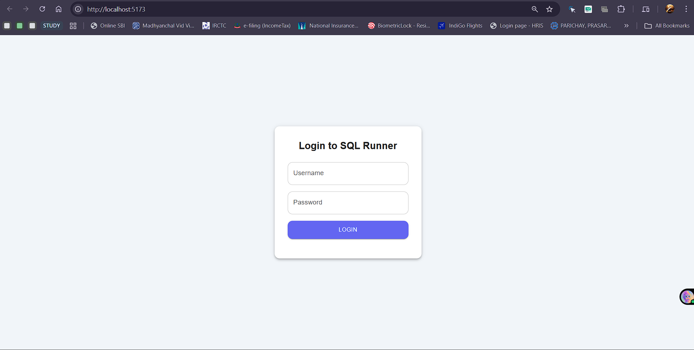

# 🧠 SQL Runner

A full-stack **SQL Runner web application** built with **React (frontend)** and **Flask (backend)** that allows users to execute SQL queries securely and visualize the results in a clean, interactive interface.  

This project demonstrates end-to-end development using modern JavaScript and Python frameworks, authentication with JWT, and dynamic data visualization using Material UI components.

---

## 🧩 Introduction
**SQL Runner** is a web-based tool that allows users to:
- Authenticate with a username and password.
- Browse available database tables and view their schema.
- Execute custom SQL queries.
- View results in a dynamic table format.
- Access recently executed queries.

It’s designed as a lightweight web-based SQL client built using **React** and **Flask**.

---

## ✨ Features
✅ JWT-based authentication  
✅ Execute any SQL command (`SELECT`, `INSERT`, `UPDATE`, `DELETE`)  
✅ View available tables and table details  
✅ Display query results in a responsive Material UI table  
✅ Browse table structure and sample rows  
✅ Recent query history  
✅ Clean, modern UI design  

---

## 🧰 Tech Stack

| Layer | Technology |
|-------|-------------|
| **Frontend** | React, Material UI, Axios |
| **Backend** | Flask, Flask-CORS, PyJWT |
| **Database** | SQLite |
| **Language** | Python 3, JavaScript (ES6+) |

---

## 📂 Project Structure


## Project Structure

```
sql-runner/
│
├── backend/
│ ├── app.py # Flask backend API
│ ├── sql_runner.db # SQLite database
│
├── frontend/
│ ├── src/
│ │ ├── App.js # Main React component
│ │ ├── Login.js # Login component
│ │ ├── index.js # React entry point
│ │ └── ...
│ └── package.json
└──  README.md


```
## Screenshots

Below are screenshots of the key interfaces in the SQL Runner:

- **Login Page**: Shows the login form with username and password.
  
- **Dashboard**: Displays the tables in sidebar, Query textbox, output and Query history.
  

*Note*: Screenshots are stored in the `Screenshots/` folder. See **Adding Screenshots** below for instructions on capturing and updating them.

## ⚙️ Installation

### 🧮 Backend Setup (Flask)
1. **Clone the repository:**
   ```bash
   git clone https://github.com/Its-Aryaman/SQL_Runner
   cd sql-runner/backend

## Create and activate a virtual environment:
```
python -m venv venv
source venv/bin/activate   # macOS/Linux
venv\Scripts\activate      # Windows
```
## Install dependencies:
```
pip install flask flask-cors pyjwt
```
## Run the backend:

Create and activate a virtual environment:
```
python -m venv venv
source venv/bin/activate   # macOS/Linux
venv\Scripts\activate      # Windows
```
Install dependencies:

```
pip install flask flask-cors pyjwt
```
Run the backend:
```
python app.py
```
The backend will start at:
👉 http://127.0.0.1:5000

## 🖥️ Frontend Setup (React)
Open a new terminal and navigate to:
```
cd sql-runner/frontend
```
Install dependencies:
```
npm install
```
Start the frontend:
```
npm start
```
The app will open automatically at:
👉 http://localhost:5173

🚀 Usage
Make sure both servers (Flask + React) are running.

Visit http://localhost:5173 in your browser.

Login using the default credentials:
```
Username: admin
Password: admin
```
Explore the tables, execute SQL queries, and view the results interactively.

🔗 API Endpoints
- **Authentication**:
  - `POST /api/auth/login`: Login and get JWT token.
Method	Endpoint	Description
  - `POST	/login`:	Authenticate user and return a JWT token
  - `POST	/run-query`:	Execute a SQL query
  - `GET	/tables`:	Retrieve all table names
  - `GET	/table-info/<table_name>`:	Get column info and sample data for a table
  - `GET	/recent-queries`:	Fetch recent user queries
⚙️ Configuration
You can customize the following in app.py:

DATABASE = "sql_runner.db"
SECRET_KEY = "my_very_secret_key"
USERNAME = "admin"
PASSWORD = "admin"
⚠️ Security Tip: For production, move these values to environment variables.

## 🧱 Setting Up the Database

To run the **SQL Runner**, you’ll need a local SQLite database (`sql_runner.db`) with some sample tables and data.

### 🧩 Step 1: Check if SQLite is Installed
Most systems include SQLite by default. To check:
```bash
sqlite3 --version
```

If you don’t see a version number:

macOS: Install via Homebrew:
```bash
brew install sqlite3
```
Windows/Linux: Visit https://www.sqlite.org/download.html for installation options.


🧩 Step 2: Create the Database File
Navigate to your backend project folder and run:
```bash
sqlite3 sql_runner.db
```
This creates a new SQLite database file and opens the SQLite shell (sqlite> prompt).

🧩 Step 3: Create Tables and Insert Sample Data
Once inside the SQLite prompt, copy and paste the SQL below to create your sample tables:

```sql
-- Create the Customers table
CREATE TABLE Customers (
  customer_id INTEGER PRIMARY KEY AUTOINCREMENT,
  first_name VARCHAR(100),
  last_name VARCHAR(100),
  age INTEGER,
  country VARCHAR(100)
);

-- Insert sample data
INSERT INTO Customers (first_name, last_name, age, country) VALUES
('John', 'Doe', 30, 'USA'),
('Robert', 'Luna', 22, 'USA'),
('David', 'Robinson', 25, 'UK'),
('John', 'Reinhardt', 22, 'UK'),
('Betty', 'Doe', 28, 'UAE');

-- Create the Orders table
CREATE TABLE Orders (
  order_id INTEGER PRIMARY KEY AUTOINCREMENT,
  item VARCHAR(100),
  amount INTEGER,
  customer_id INTEGER,
  FOREIGN KEY (customer_id) REFERENCES Customers(customer_id)
);

INSERT INTO Orders (item, amount, customer_id) VALUES
('Keyboard', 400, 4),
('Mouse', 300, 4),
('Monitor', 12000, 3),
('Keyboard', 400, 1),
('Mousepad', 250, 2);

-- Create the Shippings table
CREATE TABLE Shippings (
  shipping_id INTEGER PRIMARY KEY AUTOINCREMENT,
  status VARCHAR(100),
  customer INTEGER
);

INSERT INTO Shippings (status, customer) VALUES
('Pending', 2),
('Pending', 4),
('Delivered', 3),
('Pending', 5),
('Delivered', 1);

-- Exit SQLite
.exit
```

